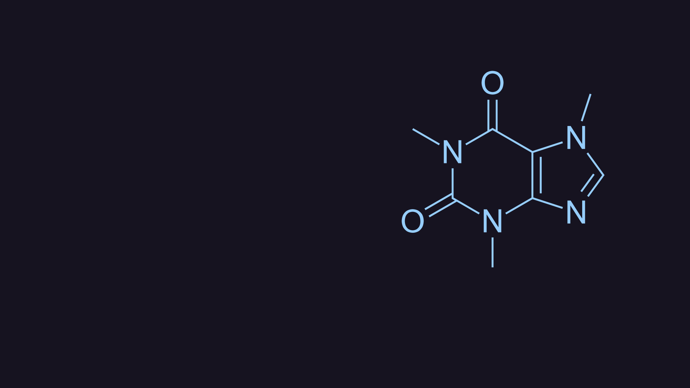

# Catppuccin Wallpapers
I was in need of wallpapers conforming to the [catppuccin](https://github.com/catppuccin/catppuccin) colorscheme.
So, I wrote a simple script to iteratively generate a set of png's,
that I can randomly assign as my desktop background using `feh`.

Using a small configuration file (see the tux [config](./src/tux/config.toml)),
I define a few properties.
Most crucially, the xpath of the element to change and an associated color palette.

All png's are hosted in the [`assets`](https://github.com/daylinmorgan/catppuccin-wallpapers/tree/assets) branch.
For convenient viewing, markdown docs are auto-generated as well containing the associated images.

## Walls

Click on an image below to see all of it's pre-generated pngs.

<table>
<tr>
<td>
<a href="./docs/tux.md">

</a>
</td>
<td>
<a href="./docs/cat.md">

</a>
</td>
</tr>
<tr>
<td>
<a href="./docs/caffeine.md">

</a>
</td>
<td>
<a href="./docs/lines.md">

</a>
</td>
</tr>
</table>

You can find `.tar.gz`'s to download of all the pre-generated png's in the [releases](https://github.com/daylinmorgan/catppuccin-wallpapers/releases/).

## Setup

### Dependencies

- [`tomli`](https://github.com/hukkin/tomli)
- [`inkscape`](https://inkscape.org)
- [`just`](https://github.com/casey/just)(optional)


```bash
git clone git@github.com:daylinmorgan/catppuccin-wallpapers.git
```

## Usage

Generate a new directory under `src`.
Within that, add a `base.svg` and `config.toml`.

Find the relevant `xpath` from your svg to change.
Define the style attribute. For now only a change in color is supported.
However if there are other properties i.e. stroke width or opacity.
You should include these in the style string with along with `{color_value}` which will be taken from the palette and populated.

```
style = "fill:{color_value};stroke-width:10;"
```

The script will determine all possible color combinations for each palette and svg element.

Currently the `generate_pngs.py` script will only make a simple modification to the underlying svg xml.
You can look at `src/tux` for an example `config.toml`.

Correctly setting the xpath may take some experimentation. 

```
./generate-pngs.py src/cool-wallpaper
```

Then run `just generate-assets update-assets`.
